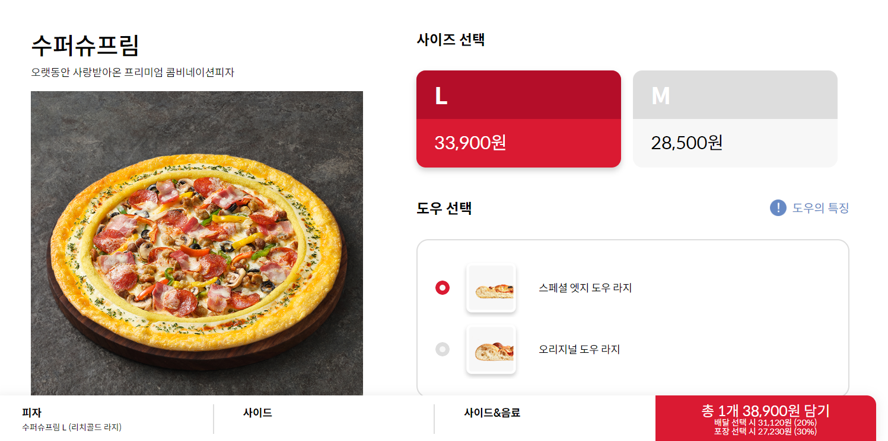
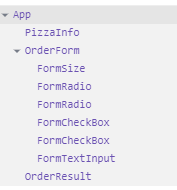
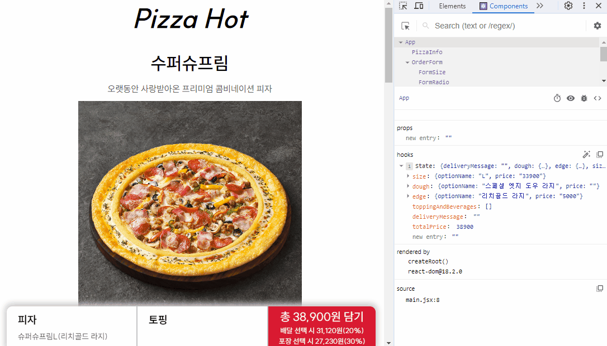

# 3주차 실습과제 : 체크박스 상태관리로 피자 토핑 올리기

## 목표

- 이번 주에 배운 useState를 사용한 상태관리, 폼 컨트롤, 상태 끌어올리기를 활용하고 체크박스를 추가하여 피자 토핑 올리기를 구현하기입니다.
- 원래 내주셨던 과제는 피자 토핑 올리기지만 지난 시간에 배운 내용들을 리마인드하고 복습할 겸 온라인 피자 주문 폼을 만들어보았습니다.

## 구현 과정

- 제가 직접 주문 페이지를 디자인할 자신도 없고 능력도 없어서 아래 사진의 피자헛 주문페이지를 참고해서 만들어보기로 결정했습니다.
  
- 이번에는 CSS module 방식을 사용하여 스타일링 했습니다.
- 상태관리를 통한 폼 컨트롤을 연습하기 위해 text, radio, checkbox를 사용했습니다.

### 컴포넌트 설계

- 폼 전체 상태관리를 하는 App 컴포넌트
- 피자 정보를 표시하는 PizzaInfo 컴포넌트
- 주문 폼을 표시하는 OrderForm 컴포넌트
- OrderForm 컴포넌트 안에 들어가는 FormSize, FormRadio, FormCheckBox 컴포넌트
- 뷰포트 하단에 폼 입력 정보를 표시하는 OrderResult 컴포넌트
  

### 데이터베이스 설계

- 피자헛의 수퍼슈프림피자를 기준으로 폼에 필요한 데이터를 json파일로 작성하였습니다.
  <details>
    <summary>pizza.json</summary>

  ```json
  {
    "name": "pizza.json",
    "version": "0.0.1",
    "author": "jykim",
    "items": [
      {
        "id": "premium-super-supreme",
        "information": {
          "pizzaName": "수퍼슈프림",
          "description": "오랫동안 사랑받아온 프리미엄 콤비네이션 피자",
          "pizzaImageUrl": "https://akamai.pizzahut.co.kr/2020pizzahut-prod/public/img/menu/RPPZ0008_RPEG0003_RPDO0005_l.png"
        },
        "options": {
          "size": [
            {
              "id": "size-large",
              "name": "L",
              "price": "33900"
            },
            {
              "id": "size-medium",
              "name": "M",
              "price": "28500"
            }
          ],
          "dough": [
            {
              "id": "dough-special-edge",
              "name": "스페셜 엣지 도우 라지",
              "imageUrl": "https://akamai.pizzahut.co.kr/2020pizzahut-prod/public/img/dou/RPDO0005_ps.png"
            },
            {
              "id": "dough-original",
              "name": "오리지널 도우 라지",
              "imageUrl": "https://akamai.pizzahut.co.kr/2020pizzahut-prod/public/img/dou/RPDO0006_ps.png"
            }
          ],
          "edge": [
            {
              "id": "edge-rich-gold",
              "name": "리치골드 라지",
              "imageUrl": "https://akamai.pizzahut.co.kr/2020pizzahut-prod/public/img/edge/RPEG0003_ps.png",
              "price": "5000"
            },
            {
              "id": "edge-cheese-crust",
              "name": "치즈크러스트 라지",
              "imageUrl": "https://akamai.pizzahut.co.kr/2020pizzahut-prod/public/img/edge/RPEG0002_ps.png",
              "price": "4000"
            },
            {
              "id": "edge-double-cheese-crust",
              "name": "더블 치즈크러스트 라지",
              "imageUrl": "https://akamai.pizzahut.co.kr/2020pizzahut-prod/public/img/edge/RPEG0039_ps.png",
              "price": "6000"
            }
          ],
          "topping": [
            {
              "id": "topping-mozzarella-cheese",
              "name": "모짜렐라 치즈",
              "imageUrl": "https://akamai.pizzahut.co.kr/2020pizzahut-prod/public/img/topping/RPTP0037_ps.png",
              "price": "2000"
            },
            {
              "id": "topping-cheddar-cheese",
              "name": "체다 치즈",
              "imageUrl": "https://akamai.pizzahut.co.kr/2020pizzahut-prod/public/img/topping/RPTP0038_ps.png",
              "price": "1000"
            },
            {
              "id": "topping-pineapple",
              "name": "파인애플",
              "imageUrl": "https://akamai.pizzahut.co.kr/2020pizzahut-prod/public/img/topping/RPTP0036_ps.png",
              "price": "1000"
            },
            {
              "id": "topping-pepperoni",
              "name": "페페로니",
              "imageUrl": "https://akamai.pizzahut.co.kr/2020pizzahut-prod/public/img/topping/RPTP0023_ps.png",
              "price": "1000"
            },
            {
              "id": "topping-casune-shrimp",
              "name": "케이준 새우",
              "imageUrl": "https://akamai.pizzahut.co.kr/2020pizzahut-prod/public/img/topping/RPTP0022_ps.png",
              "price": "3000"
            },
            {
              "id": "topping-black-olive",
              "name": "블랙 올리브",
              "imageUrl": "https://akamai.pizzahut.co.kr/2020pizzahut-prod/public/img/topping/RPTP0029_ps.png",
              "price": "1000"
            },
            {
              "id": "topping-Jalapeno",
              "name": "할라피뇨",
              "imageUrl": "https://akamai.pizzahut.co.kr/2020pizzahut-prod/public/img/topping/RPTP1443_ps.png",
              "price": "2000"
            },
            {
              "id": "topping-bacon",
              "name": "베이컨",
              "imageUrl": "https://akamai.pizzahut.co.kr/2020pizzahut-prod/public/img/topping/RPTP0021_ps.png",
              "price": "1500"
            },
            {
              "id": "topping-sausage",
              "name": "소시지",
              "imageUrl": "https://akamai.pizzahut.co.kr/2020pizzahut-prod/public/img/topping/RPTP1440_ps.png",
              "price": "2000"
            },
            {
              "id": "topping-bulgogi",
              "name": "불고기",
              "imageUrl": "https://akamai.pizzahut.co.kr/2020pizzahut-prod/public/img/topping/RPTP0024_ps.png",
              "price": "2500"
            },
            {
              "id": "topping-mushroom",
              "name": "양송이",
              "imageUrl": "https://akamai.pizzahut.co.kr/2020pizzahut-prod/public/img/topping/RPTP0031_ps.png",
              "price": "1000"
            },
            {
              "id": "topping-sweet-corn",
              "name": "스위트콘",
              "imageUrl": "https://akamai.pizzahut.co.kr/2020pizzahut-prod/public/img/topping/RPTP0035_ps.png",
              "price": "1000"
            }
          ],
          "beverage": [
            {
              "id": "beverage-cola",
              "name": "코카콜라 1.25L",
              "imageUrl": "https://akamai.pizzahut.co.kr/2020pizzahut-prod/public/img/menu/RPBE1257_s.png",
              "price": "2300"
            },
            {
              "id": "beverage-sprite",
              "name": "스프라이트 1.25L",
              "imageUrl": "https://akamai.pizzahut.co.kr/2020pizzahut-prod/public/img/menu/RPBE1262_s.png",
              "price": "2400"
            }
          ]
        }
      }
    ]
  }
  ```

  </details>

### 폼 상태관리 초깃값 설정

- useState에 넣을 초기값을 작성했습니다.
- 페이지 구현을 하면서 많은 에러와 부딪히며 수정을 거듭하였습니다...

  ```js
  const INITIAL_ORDER_FORM = {
    size: {
      optionName: 'L',
      price: '33900',
    },
    dough: {
      optionName: '스페셜 엣지 도우 라지',
      price: '',
    },
    edge: {
      optionName: '리치골드 라지',
      price: '5000',
    },
    toppingAndBeverages: [],
    deliveryMessage: '',
    totalPrice: 38900,
  };
  ```

### 컴포넌트 마크업 및 스타일링

- 각 컴포넌트를 마크업하고 css module로 스타일링했습니다.
- 최대한 div를 줄이고 시맨틱한 태그를 많이 사용하려고 노력했습니다만 이게 맞게 짠건지 모르겠습니다...

<details>

<summary>App.jsx</summary>

```js
<>
  <h1>Pizza Hot</h1>
  <main>
    {pizzaData.items.map((pizza) => {
      return (
        <div key={pizza.id}>
          <PizzaInfo data={pizza.information} />
          <OrderForm
            currentOption={order.toppingAndBeverages}
            onChangeOption={handleChangeOption}
            onToggleOption={handleToggleOption}
            onChangeMessage={handleChangeMessage}
            data={pizza.options}
            deliveryMessage={order.deliveryMessage}
          />
        </div>
      );
    })}
  </main>

  <OrderResult result={order} onSubmit={handleSubmit} />
</>
```

</details>

<details>

<summary>PizzaInfo.jsx</summary>

```js
<section className={classes.PizzaInfo}>
  <h2 className="sr-only">피자 소개</h2>
  <dl>
    <dt>{pizzaName}</dt>
    <dd>{description}</dd>
    <dd>
      <figure>
        
      </figure>
    </dd>
  </dl>
</section>
```

</details>

<details>

<summary>FormSize.jsx</summary>

```js
<fieldset className={classes.size}>
  <legend>
    <b>사이즈 선택</b>
  </legend>
  {size.map((item, idx) => {
    const price = Number(item.price).toLocaleString('ko-KR');
    return (
      <div role="group" key={item.id}>
        <input
          type="radio"
          name="size"
          id={item.id}
          value={item.price}
          defaultChecked={idx === 0}
          onChange={(e) => onChange(item.name, e)}
        />
        <label htmlFor={item.id}>
          <b>{item.name}</b>
          <span>{price}원</span>
        </label>
      </div>
    );
  })}
</fieldset>
```

</details>

<details>

<summary>FormRadio.jsx</summary>

```js
<fieldset className={classes.FormRadio}>
  <legend>
    <b>{translateOptionName(name)} 선택</b>
  </legend>

  {data.map((option, index) => {
    return (
      <div key={option.id}>
        <input
          type="radio"
          role="group"
          name={name}
          id={option.id}
          value={option?.price}
          defaultChecked={index === 0}
          onChange={(e) => onChange(option.name, e)}
        />
        <label htmlFor={option.id}>
          <figure>
            
            <figcaption>{option.name}</figcaption>
          </figure>
          {option.price && (
            <span>+{Number(option.price).toLocaleString('ko-KR')}원</span>
          )}
        </label>
      </div>
    );
  })}
</fieldset>
```

</details>

<details>

<summary>FormCheckBox.jsx</summary>

```js
<fieldset className={classes.FormCheckBox}>
  <legend>
    <b>{translateOptionName(name)} 추가</b>
  </legend>
  <span>
    ※ 피자 1판당 3개 {translateOptionName(name)} 추가 가능합니다. (중복불가)
  </span>

  {data.map((option) => {
    return (
      <div role="group" key={option.id}>
        <input
          type="checkbox"
          name={name}
          id={option.id}
          onChange={(e) => onChange(option, e)}
          value={option?.price}
        />
        <label htmlFor={option.id}>
          <figure>
            
            <figcaption>{option.name}</figcaption>
          </figure>
          <span>+{Number(option.price).toLocaleString('ko-KR')}원</span>
        </label>
      </div>
    );
  })}
</fieldset>
```

</details>

<details>

<summary>FormTextInput.jsx</summary>

```js
<fieldset className={classes.FormInput}>
  <legend>
    <b>주문 전달사항 메세지 입력</b>
  </legend>
  <div role="group">
    <label className="sr-only" htmlFor={id}>
      <b>전달사항</b>
    </label>
    <ComponentName
      type="text"
      name={name}
      id={id}
      value={message}
      onChange={onChange}
      placeholder="주문 시 전달할 메세지를 입력해주세요."
    />
  </div>
</fieldset>
```

</details>

<details>

<summary>OrderResult.jsx</summary>

```js
<footer className={classes.OrderResult}>
  <div>
    <div>
      <b>피자</b>
      <span>슈퍼슈프림L({edge.optionName})</span>
    </div>
    <div>
      <b>토핑</b>
      <span>
        {toppingAndBeverages.map((item) => item.optionName).join(', ')}
      </span>
    </div>
    <div>
      <button type="submit" form="orderForm" onClick={(e) => onSubmit(e)}>
        <span>총 {totalPrice.toLocaleString('ko-KR')}원 담기</span>
        <span>
          배달 선택 시 {(totalPrice * 0.8).toLocaleString('ko-KR')}원(20%)
        </span>
        <span>
          포장 선택 시 {(totalPrice * 0.7).toLocaleString('ko-KR')}원(30%)
        </span>
      </button>
    </div>
  </div>
</footer>
```

</details>

### 업데이트 함수 작성

- 각 컴포넌트의 상태를 App컴포넌트에서 관리하기때문에 상태 업데이트 함수를 App컴포넌트에 작성하고 각 컴포넌트 props로 전달하였습니다.
- 상태 업데이트 함수는 각 input의 type별로 radio, checkbox, text 3개의 상태를 업데이트하는 함수를 작성했습니다.
- 그 중에 checkbox 상태 업데이트하는 것이 가장 어려웠습니다. 어떻게 구현을 하긴 했는데 버그가 많아서 부족한 부분이 많이 보였습니다.

<details>

<summary>handleChangeOption 함수(radio 상태관리)</summary>

```js
const handleChangeOption = (optionName, { target: { name, value } }) => {
  setOrder((prev) => {
    let nextValue = { ...prev, [name]: { optionName, price: value } };
    const totalPrice = caculateTotalPrice(nextValue);
    return { ...nextValue, totalPrice };
  });
};
```

</details>

<details>

<summary>handleToggleOption (checkbox 상태관리)</summary>

```js
const handleToggleOption = (
  { id: optionId, name: optionName },
  { target: { value, checked } }
) => {
  setOrder((prev) => {
    const isExist =
      prev.toppingAndBeverages.findIndex((item) => item.id === optionId) >= 0;
    if (isExist && !checked) {
      const newValue = prev.toppingAndBeverages.filter(
        (item) => item.id !== optionId
      );
      const nextValue = { ...prev, toppingAndBeverages: newValue };
      const totalPrice = caculateTotalPrice(nextValue);
      return { ...nextValue, totalPrice };
    }
    const nextValue = {
      ...prev,
      toppingAndBeverages: [
        ...prev.toppingAndBeverages,
        { id: optionId, optionName, price: value },
      ],
    };
    const totalPrice = caculateTotalPrice(nextValue);
    return { ...nextValue, totalPrice };
  });
};
```

</details>

<details>

<summary>handleChangeMessage (text 상태관리)</summary>

```js
const handleChangeMessage = ({ target: { value } }) => {
  setOrder((prev) => ({ ...prev, deliveryMessage: value }));
};
```

</details>

## 동작 시연



## 회고

- 다시 한번 수업에서 배운 내용들을 생각하면서 직접 만들어보니 수업으로 듣는 것보다 직접 코드를 작성하면서 하나씩 만들어보는 습의 시간이 얼마나 중요한지 깨닫게되었습니다.
- 체크박스 상태관리 부분이 정말 정말 어려워서 미완성인데, 완벽하게 동작을 안하는게 너무 아쉬웠습니다.
- 체크박스를 3개보다 많이 체크를 하려고 하면 체크와 상태 업데이트를 안하고 경고창을 띄우려고 했습니다.
- 상태 업데이트까진 못하게 막았는데 체크는 막는 방법을 몰라서 구현하지 못했습니다.
- 이벤트 핸들링으로 체크를 못하게 막는방법이 궁금합니다.
