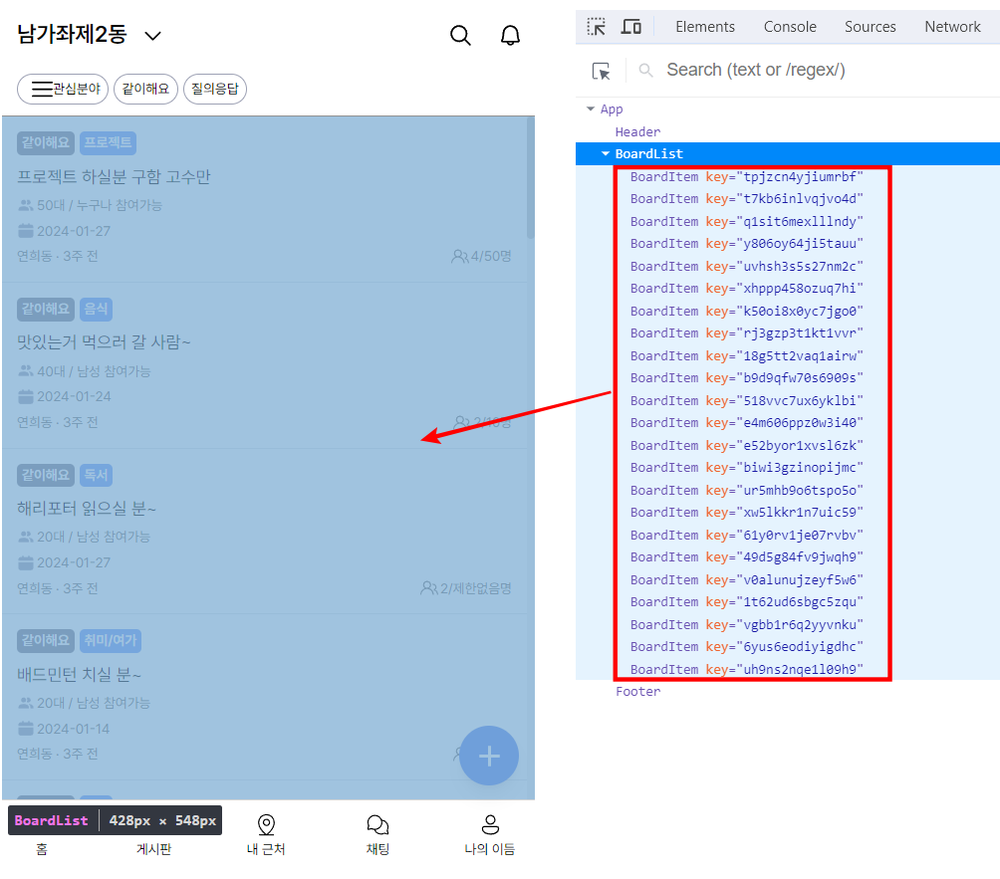

## 2주차 과제

### 목차

- [과제 목표](#🎯-과제-목표)
- [수행 과정](#🎞-수행-과정)
- [회고](#🤔-회고)

### 🎯 과제 목표

- 바닐라 프로젝트에서 활용했던 데이터 베이스를 로컬에 저장하고 그 JSON 데이터를 불러와 마크업에 연결 및 UI를 구현하기

### 🎞 수행 과정

#### 1. 포켓베이스 데이터베이스를 JSON 데이터로 저장

- 포켓베이스에서 데이터를 JSON파일로 다운받으려고 했으나 다운받는 기능을 찾을 수가 없어서 대신 바닐라 프로젝트 페이지 접속 후 크롬 개발자모드로 들어가서 네트워크 탭에서 수신한 데이터를 복사하여 JSON파일에 저장했습니다.

  <details>
    <summary><b>articleData.json 코드</b></summary>

  ```json
  {
    "page": 1,
    "perPage": 500,
    "totalItems": -1,
    "totalPages": -1,
    "items": [
      {
        "age": "50",
        "category": "프로젝트",
        "chatroomId": "",
        "collectionId": "fnh5xogh68g50w6",
        "collectionName": "together",
        "created": "2024-01-05 07:19:00.105Z",
        "date": "2024-01-27 12:00:00.000Z",
        "description": "프론트엔드가 한분 부족해서 뽑습니다",
        "gender": "누구나",
        "id": "tpjzcn4yjiumrbf",
        "isApproval": false,
        "isOpen": true,
        "maxMember": "50",
        "members": ["3tok7430sjy30hs", "niy2e4v0awk17l2", "svgib5k0l2ylvdy", "6j5tt6hma7og5dw"],
        "title": "프로젝트 하실분 구함 고수만 ",
        "type": "together",
        "updated": "2024-01-16 02:47:24.042Z",
        "user": "3tok7430sjy30hs"
      }
      // ...
    ]
  }
  ```

  </details>

#### 2. 컴포넌트 마크업에 데이터 연결

- 저장한 JSON 데이터를 UI와 연결하기 위해서 `BoardItem`이라는 컴포넌트를 만들고 데이터 아이템이 전달하는 props를 받고 바인딩하는 부분을 작성했습니다.

  <details>
    <summary><b>BoardItem.jsx 코드</b></summary>

  ```js
  import { convertTime } from "../../lib/utils/convertTime";

  export default function BoardItem({ category, title, age, gender, date, created, members, maxMember }) {
    return (
      <li className="hover:bg-gray-100 ">
        <div className="relative p-3 flex flex-col justify-center items-start gap-1 border-b">
          <div className="flex items-center gap-1 mb-7">
            <span className="text-label-sm p-1 leading-none bg-bluegray-600 text-white rounded">같이해요</span>
            <span className="text-label-sm p-1 leading-none bg-tertiary text-white rounded">{category}</span>
          </div>
          <a href="" className="absolute top-0 left-0 w-full h-full flex-auto text-paragraph-md font-normal text-contents-content-primary ">
            <span className="absolute top-[38px] left-3 w-[90%] overflow-hidden whitespace-nowrap text-ellipsis">{title}</span>
          </a>
          <span className="pl-4 text-paragraph-sm font-normal text-gray-600 bg-people_full-icon bg-no-repeat bg-left">
            {age}대 / {gender} 참여가능
          </span>
          <span className="pl-4 text-paragraph-sm font-normal text-gray-600 bg-calender-icon bg-no-repeat bg-left">{date.slice(0, 10)}</span>
          <div className="w-full flex justify-between">
            <span className="text-paragraph-sm font-normal text-gray-600">연희동 · {convertTime(created)}</span>
            <span className="pl-4 text-paragraph-sm font-normal text-gray-600 bg-people-icon bg-no-repeat bg-left">
              {members.length}/{maxMember}명
            </span>
          </div>
        </div>
      </li>
    );
  }
  ```

  </details>

#### 3. BoardItem 컴포넌트 리스트 렌더링

- `BoardList`라는 컴포넌트를 만들고 JSON 데이터에 배열 메서드 `map()`을 사용하여 2번에서 작성한 BoardItem 컴포넌트를 리스트 렌더링했습니다.
- 리스트 렌더링에서 매우 중요한 key prop은 JSON 데이터의 `id` 값으로 전달했습니다.
- key prop을 제외한 나머지 props는 일일이 하나씩 넘기지 않고 `spread syntax`로 한번에 넘겼습니다.
- 그리고 수업시간에 배운 if문을 활용한 조건부 렌더링 구문을 추가하였습니다.
- 데이터의 item안에 내용이 있는지 여부를 담은 `isExist` 변수를 만들고 컨텐츠를 담을 `contents` 변수를 만들어서 if문에 따라 컴포넌트를 리스트 렌더링 할 것인지, 게시물이 없다는 문구를 렌더링할 것인지 나눴습니다.

  <details>
    <summary><b>BoardList.jsx 코드</b></summary>

  ```js
  import articleData from "../../data/articleData.json";
  import BoardItem from "./BoardItem";

  export default function BoardList() {
    const isExist = articleData.items.length > 0;
    let contents = <li>게시물이 없습니다.</li>;
    if (isExist)
      contents = articleData.items.map((item) => {
        return <BoardItem key={item.id} {...item} />;
      });
    return (
      <main className="relative overflow-x-hidden overflow-y-auto flex-1">
        <h2 className="sr-only">게시글 목록</h2>
        <ul>{contents}</ul>
      </main>
    );
  }
  ```

  </details>

#### 4. 결과 확인

- 웹 페이지에 정상적으로 UI가 렌더링 된 것을 볼 수 있었습니다.
- 그리고 리액트 개발자 도구로 컴포넌트를 확인해봤는데 `BoardList` 컴포넌트 안에 `BoardItem` 컴포넌트가 각각 고유한 key를 가지고 리스트 렌더링이 된 것을 알 수 있었습니다.
  

### 🤔 회고

- 과제에서 요구한 대로 바닐라 자바스크립트 프로젝트의 JSON 데이터를 활용하여 수업시간에 배운 리스트 렌더링을 구현해보고 또 제 나름대로 조건부 렌더링을 추가적으로 구현해보았습니다.
- 데이터를 어딘가로부터 받아오고 그것을 UI 컴포넌트에 연결시키기 위해서 리스트 렌더링이 정말 중요하다는 것을 알았고, key의 중요성을 알게되었습니다.
